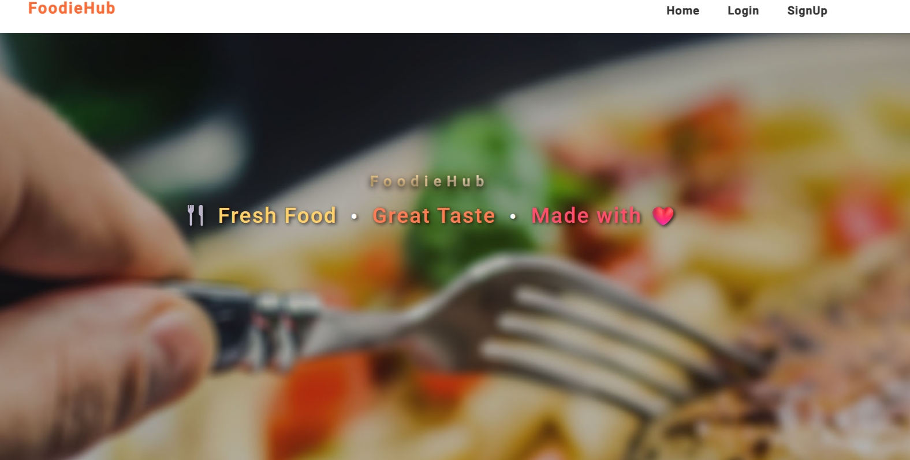
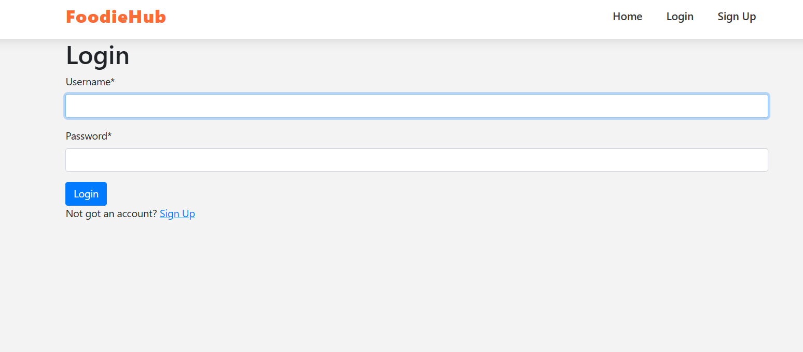
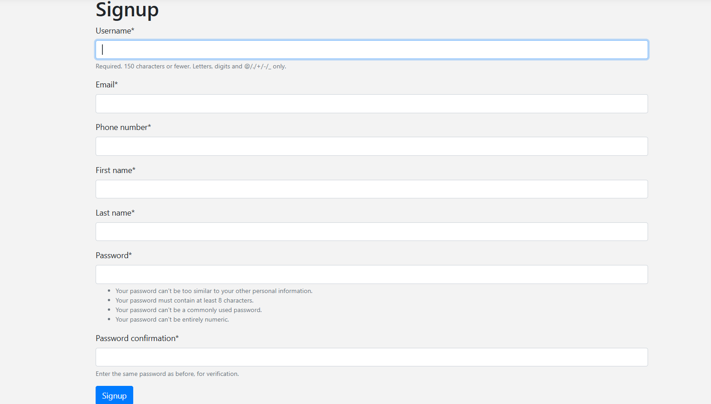
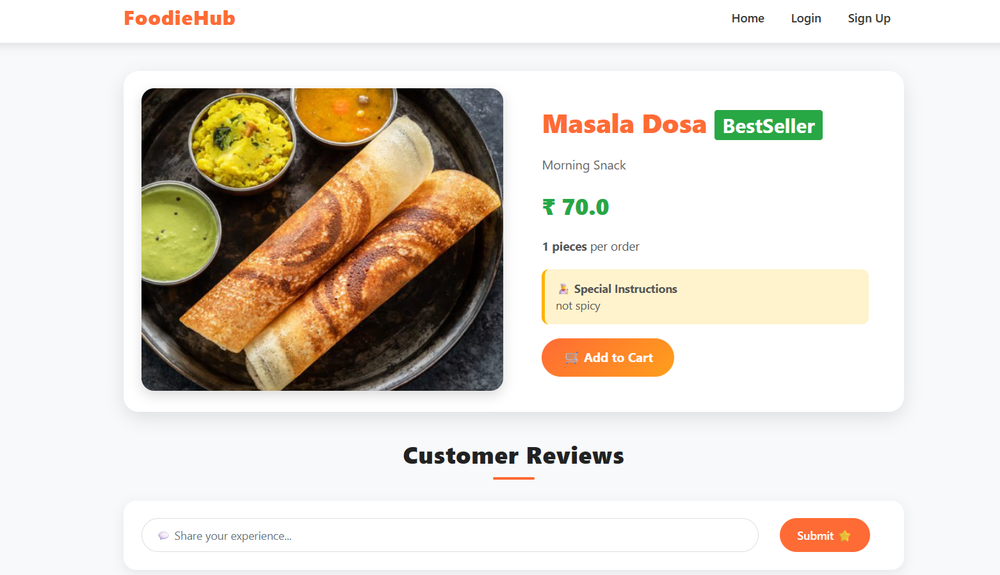
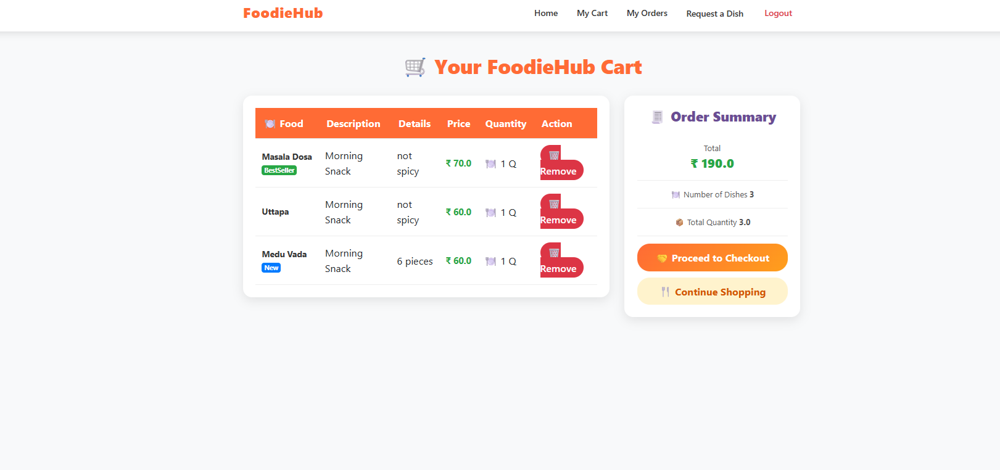
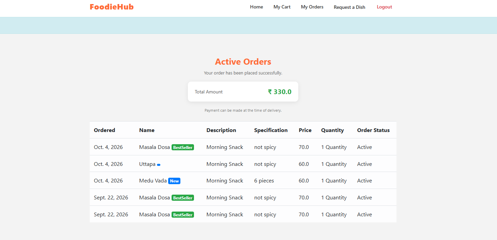
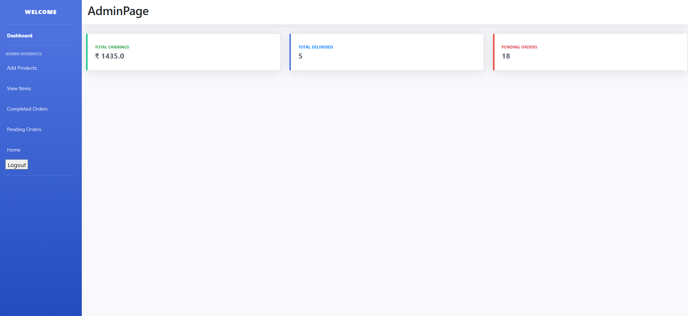

## Home Screen

# Django-Online-Food-ordering-System
## This system displays available dishes with its name, photo, category, price, and the user has to enter the quantity and customer’s name. The customer can order through online and can see she/his orders in the cart.

### Features of Online Food Ordering System using Django

* Dashboard – For the admin dashboard, you will be able to all the basic access in the whole system. Such as cart items orders, items, users and categories.

* Manage Items– The admin has access to the item management information system. He can add, update and delete the items.

* Manage Orders – As the main functions of the admin, the admin can reject or accept from the customers on a case to case basis.

* Manage Categories – For the categories, the admin has the features of managing the category. The example category used in this system is best selling foods, spicy, and new  foods.

* Manage Users – The admin can manage the user’s account. Admin can add, update and delete users in the system.

* Login and Logout – By default one of the security features of this system is the secure login and logout system.

## Home Screen

## Login

## Signup

## View Item

## Add to Cart

## Placed Order

## Admin Dashboard

## Admin add item

## Admin view item

## Admin pending order

## Admin compleated order

